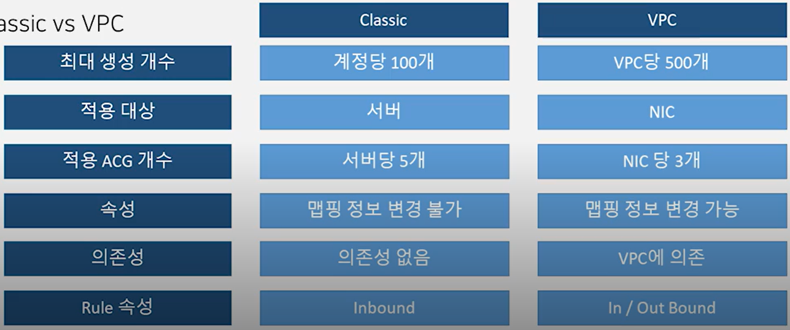

# 3.Server Operation

## server operation 방안

1. 웹 콘솔 이용
   - 웹 화면서에 마우스 조작으로 server 조작
2. CLI operation
   - cli 명령어를 통해 server 조작
   - object storage의 경우 aws cli 사용
3. API operation
   - api를 사용하여 server 조작
   - S3의 경우 aws api 사용

## server operaion 종류

1. server image

   - os / volume 대상

   - 기존 서버의 백업본을 만듦

     ##### => 서버가 망가졌을 경우 해당 서버의 image를 사용하여 restore 가능

     ##### => auto scaling 에도 server image 활용 가능

     ##### 	=> server image는 추가 storage까지 image로 기록해 두기 때문에 a.s 에 사용시 추가 볼륨 제거 후 사용하는 것을 권장

   - Classic -> 서버 off시 생성 가능 / VPC -> 서버 on 상태에서도 생성 가능

2. snapshot

   - volume 대상

   - 서버의 OS를 제외한 볼륨의 상태를 스냅샷으로 남김

     ##### => 기존 서버의 OS가 고장났을 때 볼륨의 스냅샷을 이용하여 다른 서버의 추가 볼륨으로 추가 가능

3. 유사 OS

   - 서버의 OS 대상
   - 서버 생성시 기존 서버의 설정만 저장하여 깡통 서버(데이터가 없는 서버) 생성

4. server image builder

   - Packer 를 이용한 image 생성 서비스

5. Init Script

   - 서버 생성 직후 1회 작동하는 script를 통해 설정,필요 프로그램 다운로드 등 기본 환경 세팅 가능

     ##### => script를 실행시켜 작동하기 때문에 server image 보다 속도가 느림

     ##### => a.s에 활용하기 위해서는 server image와 적절하게 섞어서 사용하는 것을 권장

6. ACG(Access Control Group)
   - 서버의 방화벽으라고 생각하면 됨
   - classic은 의존성 없이 모든 region에 적용되지만 vpc는 vpc에 의존하여 적용되는 특징이 두드러짐

