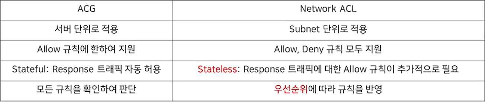

# 5.VPC Subnet ACG/NACL

- VPC - IP대역 결정
- Subnet - VPC 내에서 네트워크 segment 구성
- VPC Peering - VPC간 사설 통신 연결
  - 타 계정/ 내 계정 모두 사용 가능
- Route Table / Virtual Private Gateway - VPN/전용선 연결시 통신 연결

## VPC

- Cloud 상에서 논리적으로 격리된 전용 네트워크 공간
  - 현재 한국 region만 사용 가능
  - 계정당 최대 3개 생성 가능
- IP주소 범위
  - 10.0.0.0/8 192.168.0.0/16 172.16.0.0/12 중 선택 가능
  - 최소 /28 부터 최대 /16 까지 생성 가능
- Peering
  - VPC간 연결을 위한 네트워크 구성
  - 타 계정/내 계정 모두 사용 가능

## ACG/NACL



- NACL이 Subnet에 적용되어 있기 때문에 외부 접근시 우선적으로 룰 검사를 시행하고 이후 ACG의 룰이 적용된다.

- ACG의 경우 화이트리스트 방식 보안, NACL의 경우 화이트/블랙 리스트 방식 보안을 사용한다.

- 단일 VPC당 최대 200개의 Subnet 생성이 가능하다.

- Public Subnet내의 서버만 Public IP 부여가 가능하다

  - Public Subnet - 서버만 위치 가능
  - Private Subnet - 서버,로드밸런서 위치 가능

  ```bash
  Stateful / Stateless
  client가 server에 requet할 때 전자는 들어오는 규칙에 막히지 않았기 때문에 나가는 response 트레픽을 자동으로 허용한다. 후자의 경우 Allow 규칙이 따로 정의되어 있어야 나가는 response 트레픽을 허용한다.
  ```

  