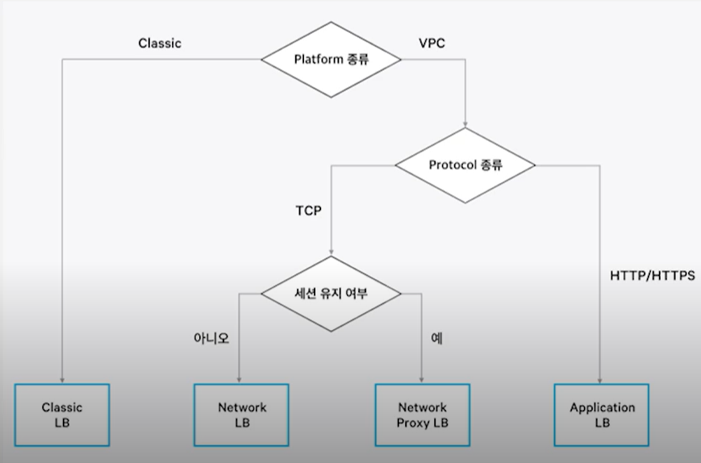
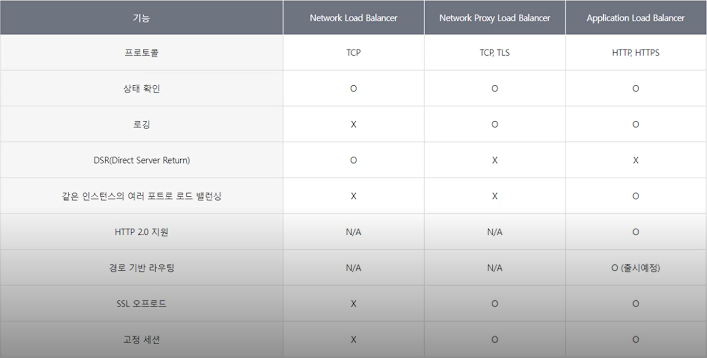

# Load balancer,CDN

- 트래픽을 분산 처리 하여 과부하를 막아주는 장치

## Target Group

- VPC 서버 들에 대해 load balancer를 적용할 target group을 지정할 수 있다.

  ##### => 한 server가 다수의 target group에 속할 순 있지만, 한 target group은 단일 load balancer를 사용해야 한다.

## 성능

- 부하 처리 성능에 따라 small/medium/large 중 선택할 수 있다.
- CPS(초당 연결 수) 기준 30000/60000/90000 개의 분산처리를 보장한다.

## 알고리즘

- Round Robin - 트래픽이 들어온 순서대로 처리
- Least Connection - 연결이 적은 서버에 커넥션 분배
- IP HASH

## 종류

- Application Load Balancer
  - 고정 IP 사용
  - 3가지 알고리즘 사용
  - HTTP/HTTPS
  - URL 기반 분기 가능 
    - www.naver.com/news << news 부분을 보고 분기가 가능
- Network Load Balancer
  - cilent IP 그대로 로깅
  - R.R HASH 알고리즘 사용
  - TCP
  - 고성능 분산처리
- Network Proxt Load Balancer
  - TCP
  - Classic Load Balancer와 비슷

