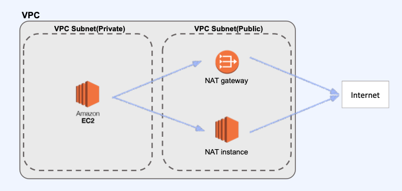
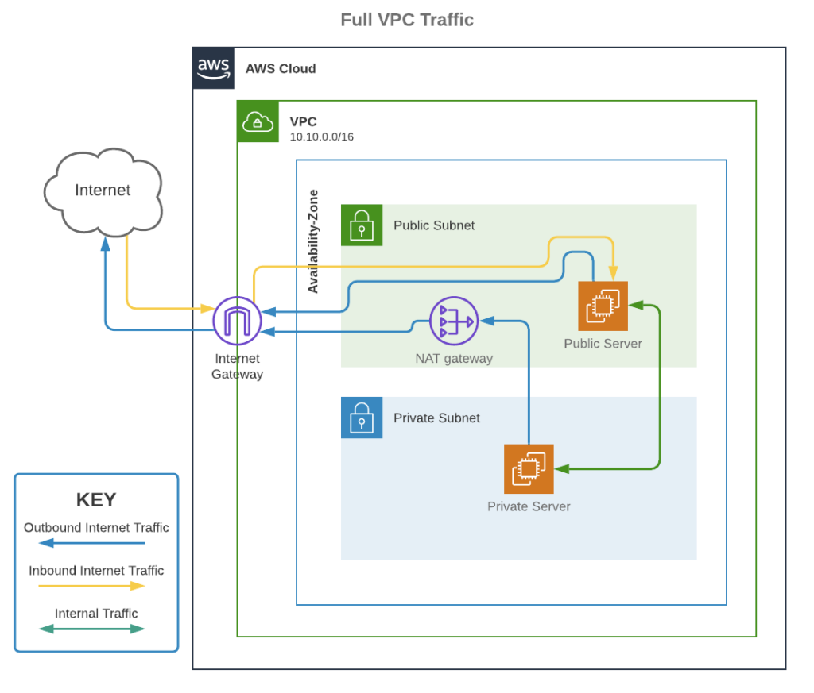

# IPSEC VPN

- 고객 사내 망과 NCP간 터널링을 통해 사설 통신을 하는 것 처럼 보이게 하는 장치

```
(Classic) 사내 망의 경우 Private Subnet을 사용하여 192.168.x.x 으로 통신이 필요하다. 사내망 / NCP 간 VPN 장비간 터널링을 제공하여 Private Subnet에 접근을 가능하게 한다.
(VPC)Private 뿐만 아니라 Subnet만 있으면 가능할 것이다.(아직 미출시)
```

- 최대 BW를 30Mbps까지 제공한다.


# NAT Gateway

- Outbound Traffic의 경우 IP가 가변적이다. 이때의 IP를 고정하기 위해 사용하는 장치다. 
- Private Subnet은  외부로 접근 하는 것이 불가능하다. 그래서 중간에 Pubilc Subnet 안에 NAT Gateway를 두어 외부로 접근을 가능케 하고 외부에서 접근을 차단한다.



- Private Subnet 자체로는 Inbound Traffic가 크게 필요하지 않다. 하지만 펌웨어 업데이트 등의 이유로 Outbound Traffic이 필요한 경우가 있다. 그때 NAT Gateway를 사용한다.



-  ###### 이미지 출처 - https://www.uturndata.com/2021/02/23/aws-quick-tips-internet-gateways-nat-gateways-and-nat-instances/

# Global Route Manager

- Load Balancer와 Healty Check를 동시에 수행하기 위한 서비스 GSLB를 사용한다.
- 수행 절차
  1. 다양한 리전에 분산된 서버 
  2. 한 서버 응답 없음
  3. GSLB에서 Health Check 수행
  4. 해당 서버에 사용자가 접근했을 떄 다른 IP로 연결

##### 		=> LoadBalance와 HealthCheck를 Domain단위로 동시에 수행한다. 따라서 사용자는 서버를 리전 단위로 분산해 두고 GSLB를 사용한다면 안정적인 운영이 가능하다.

